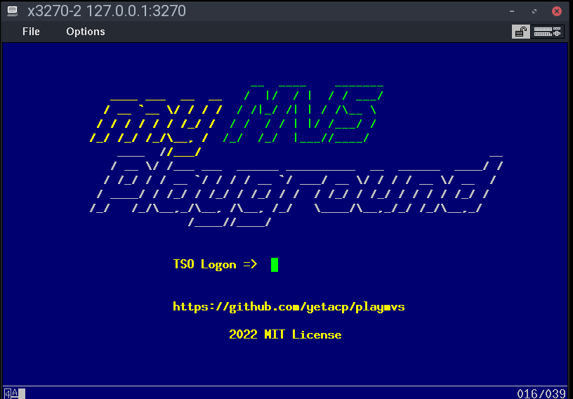

# My MVS

|  |
| ------ |

My custom MVS generated by Sysgen.

## Logon

| Command                  | Action                                |
|:------------------------:|:-------------------------------------:|
| LOGON HMVS01             | logon HMVS01 user, with 8192Kb storage |
| LOGON HMVS01 SIZE(4096)  | logon HMVS01 user, with 4096Kb storage |

## Users

| Username | Password | Role        |
|:--------:|:--------:|:-----------:|
| IBMUSER  | SYS1     | Super user  |
| HMVS01   | CUL8TR   | Admin       |
| HMVS02   | PASS4U   | Normal user |

## Software
- MVS 3.8j
- Automated MVS3.8j Sysgen
- Assembler updates
- BLKDISK
- BREXX370 2.5
- EZASMI
- FSI
- FSS
- FTPD
- IMON370
- INDFILE
- MDDIAG8
- OFFLOAD
- QUEUE
- RAKF
- REVIEW 50.3
- RPF 1.92
- SYSCPK compilers

## DASD
- See https://ibmmainframes.com/references/disk.html

### PUB000 
- model: 3380 
- cyls: 886 
- heads: 15 
- tracks: 13290 
- trklen: 47616
- bytes per track: 47,476
- bytes per cylinder: 712,140
- bytes per module: 630,243,900

### PUB001 
- model: 3390 
- cyls: 1114 
- heads: 15
- tracks: 16710
- trklen: 56832
- bytes per track: 56,664
- bytes per cylinder: 849,960 
- bytes per module: 946,005,480

## Running MyMVS

### 01_mvs_ramdisk_create.sh
- Increase speed and throughput of DASD volumes creating a RAM disk.

### 02_mvs_start.sh
- Initialize MVS in attended mode
- Restore shadow snapshots from dasd_shadows.tar.gz
- If you turn off hercules, you don't damage DASD files. Sometimes, I prefer to kill Hercules and restart MVS again.
- TODO make a finalization attended mode

### 03_mvs_save_state.sh
- After shutdown MVS, you may/must save current DASD shadow files.
- Rename and move current dasd_shadows.tar.gz in ./backups folder.
- Save shadow files from RAM DISK into a tgz file.

### 04_mvs_ramdisk_destroy.sh
- Destroy RAM DISK

### 05_listen_console.sh
- When VTAM (MVS) is on, a x3270 console is started.
- You need to install x3270
- Ubuntu/Debian: sudo apt -y install x3270

### 06_update_spool.sh
- Adapted script from MVSSplit
- Separate job reports from 'prt00e.txt' to 'spool' folder
